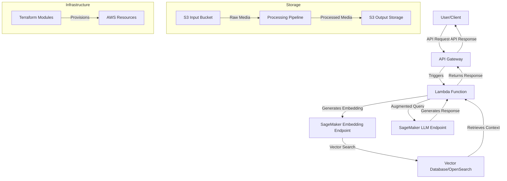

# Video Pipeline

A scalable video and audio processing pipeline built on AWS infrastructure using Terraform, featuring RAG (Retrieval-Augmented Generation) capabilities for intelligent content processing.

## Architecture Overview



## Project Structure

```
video-pipeline/
├── infra/                      # Terraform infrastructure code
│   ├── environments/           # Environment-specific configurations
│   │   ├── dev/                # Development environment
│   │   └── prod/               # Production environment
│   └── modules/                # Reusable Terraform modules
│       ├── s3/                 # S3 bucket configurations
│       ├── lambda/             # Lambda function resources
│       ├── step_functions/     # Step Functions workflows
│       └── vector_db/          # Vector database resources
├── src/                        # Application source code
├── tests/                      # Test suite
│   ├── unit/                   # Unit tests
│   └── integration/            # Integration tests
└── video-pipeline-specs/       # Specifications and documentation
    ├── documentation/          # Project documentation
    └── prompts/                # Architecture prompts
```

## Features

- **Media Processing**: Scalable video and audio processing pipeline
- **RAG Pipeline**: Retrieval-Augmented Generation for intelligent content analysis
- **Vector Search**: Content similarity search capabilities
- **API Integration**: Endpoints for accessing pipeline functionality
- **Infrastructure as Code**: Fully defined AWS infrastructure using Terraform
- **Lifecycle Management**: Automated transition of objects to cheaper storage tiers

## Getting Started

### Prerequisites

- AWS Account with appropriate permissions
- Terraform >= 1.2.0
- AWS CLI configured with valid credentials
- Python 3.8+

### Installation

1. Clone this repository:
   ```bash
   git clone [repository-url]
   cd video-pipeline
   ```

2. Initialize the Terraform environment:
   ```bash
   cd infra/environments/dev
   terraform init
   ```

3. Deploy the infrastructure:
   ```bash
   terraform apply
   ```

### Configuration

The pipeline can be configured through Terraform variables:

- `environment`: Deployment environment (dev/prod)
- `aws_region`: AWS region for resource deployment
- `cors_allowed_origins`: CORS configuration for S3 buckets
- `transition_standard_ia_days`: Days before transitioning to STANDARD_IA storage
- `transition_glacier_days`: Days before transitioning to GLACIER storage

## Usage

### Uploading Media

Upload media files to the generated S3 input bucket:

```bash
aws s3 cp your-video.mp4 s3://[bucket-name]/input/
```

### Processing Pipeline

The pipeline automatically processes uploaded files through configured workflows.

### API Access

Access the RAG pipeline functionality through the API Gateway endpoint:

```bash
curl -X POST \
  https://[api-gateway-url]/query \
  -H 'Content-Type: application/json' \
  -d '{"query": "your search query"}'
```

## Development

### Testing

Run the test suite:

```bash
cd tests
pytest
```

### Adding New Components

1. Create new Terraform modules in `infra/modules/`
2. Include modules in environment configurations
3. Update documentation and diagrams

## Infrastructure Management

### Applying Changes

```bash
cd infra/environments/dev
terraform plan    # Review changes
terraform apply   # Apply changes
```

### Destroying Resources

```bash
cd infra/environments/dev
terraform destroy
```

## Documentation

- Architecture diagrams use Mermaid syntax
- Code documentation follows Python docstring standards
- Infrastructure documentation in module README files

## License

[Specify your license]

## Contributing

[Contribution guidelines] 