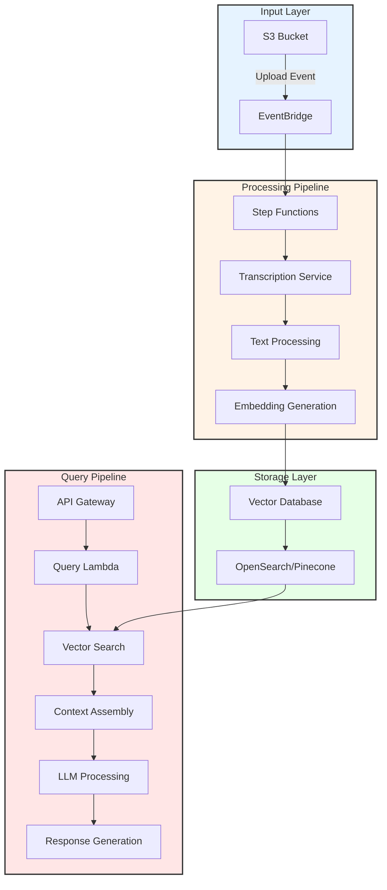
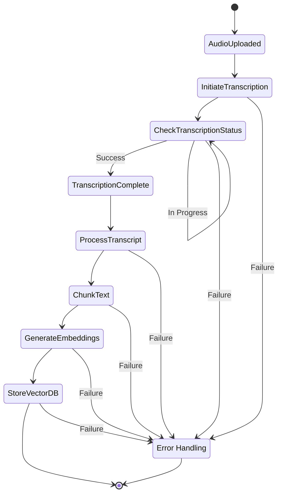
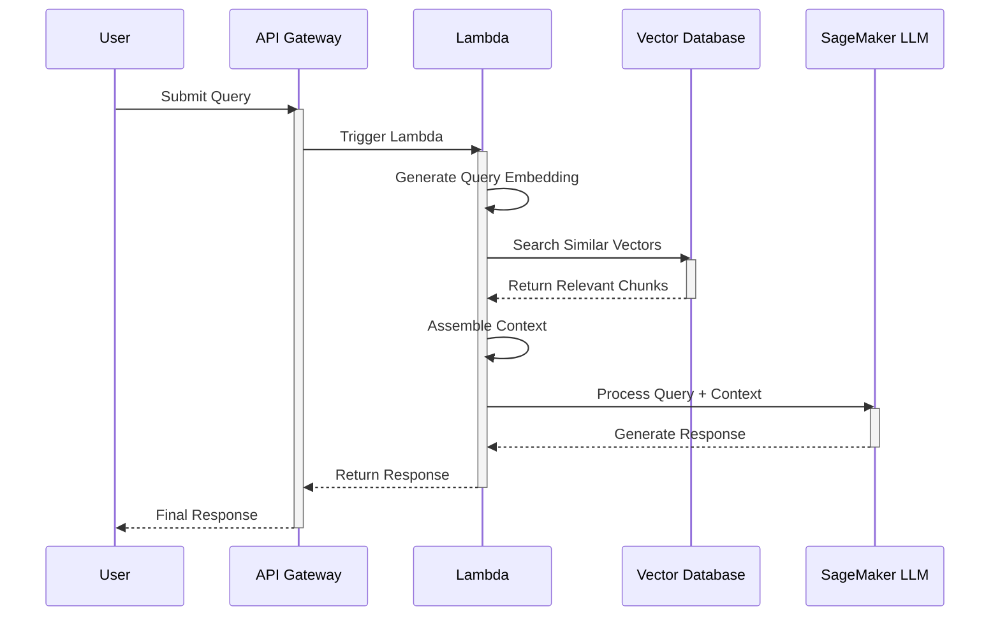
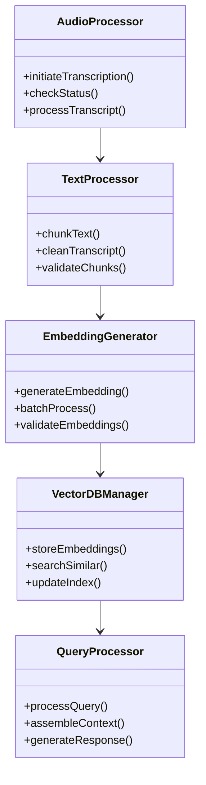
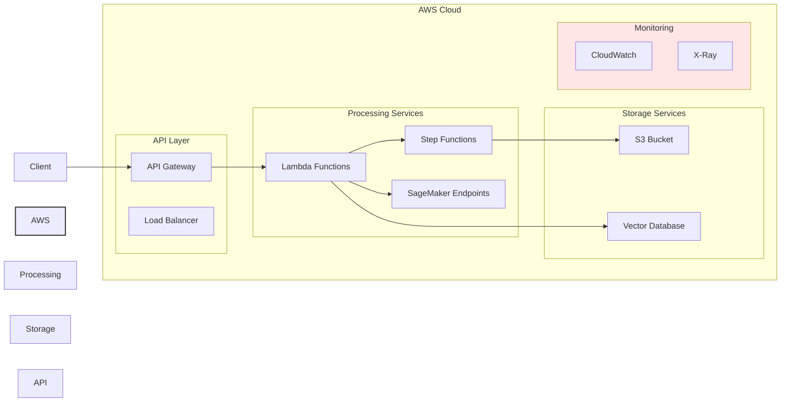

# Video Pipeline Architecture Documentation

This document outlines the complete architecture of our video processing and RAG (Retrieval-Augmented Generation) pipeline system.

## System Overview

## Step Functions Workflow

## RAG Query Sequence

## Component Architecture

## Deployment Architecture

## Implementation Notes

1. **Audio Processing Pipeline:**
   - S3 event notifications trigger Step Functions workflow
   - Parallel processing for multiple audio files
   - Automatic retry mechanisms for failed steps
   - CloudWatch monitoring for each step

2. **Text Processing:**
   - Chunking by natural language boundaries
   - Metadata preservation for each chunk
   - Efficient batch processing

3. **Vector Database:**
   - OpenSearch with kNN plugin configuration
   - Optimized index settings
   - Backup and recovery procedures

4. **Query Pipeline:**
   - Load balancing for high availability
   - Response caching where appropriate
   - Error handling and fallback strategies

## Security Considerations

1. **IAM Roles and Permissions:**
   - Least privilege access
   - Service-specific roles
   - Resource-based policies

2. **API Security:**
   - API key management
   - Request throttling
   - Input validation

3. **Data Protection:**
   - Encryption at rest
   - Encryption in transit
   - Access logging

## Monitoring and Maintenance

1. **CloudWatch Metrics:**
   - Processing latency
   - Error rates
   - Resource utilization

2. **Alerting:**
   - Processing failures
   - API errors
   - Resource thresholds

3. **Maintenance:**
   - Regular backups
   - Index optimization
   - Model updates
